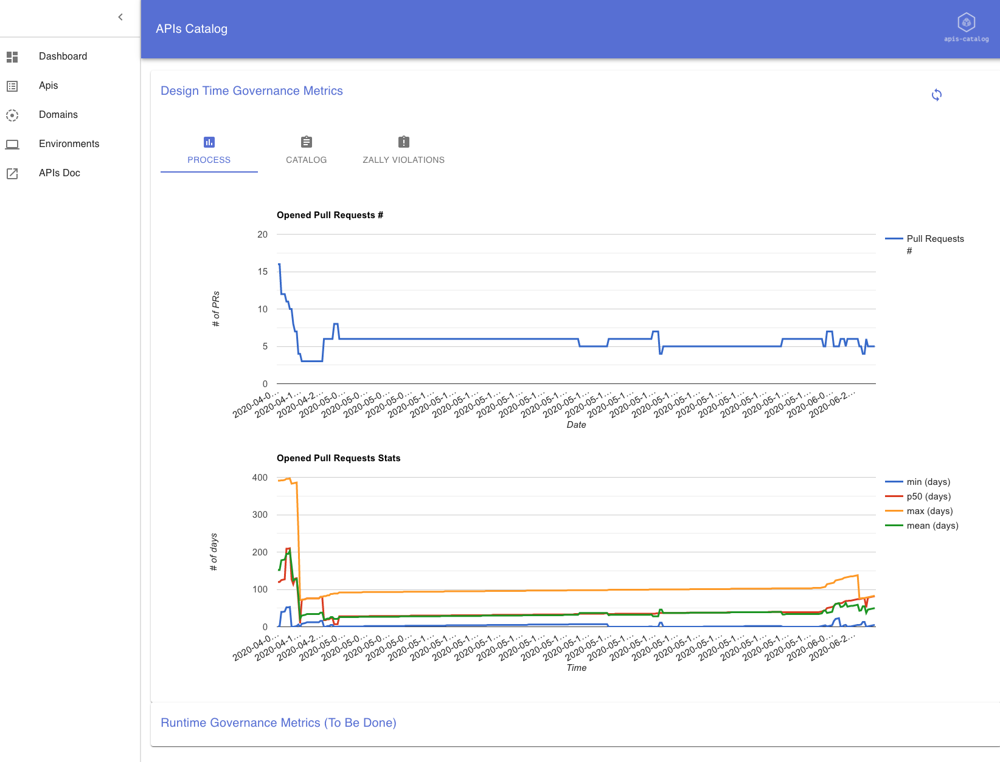
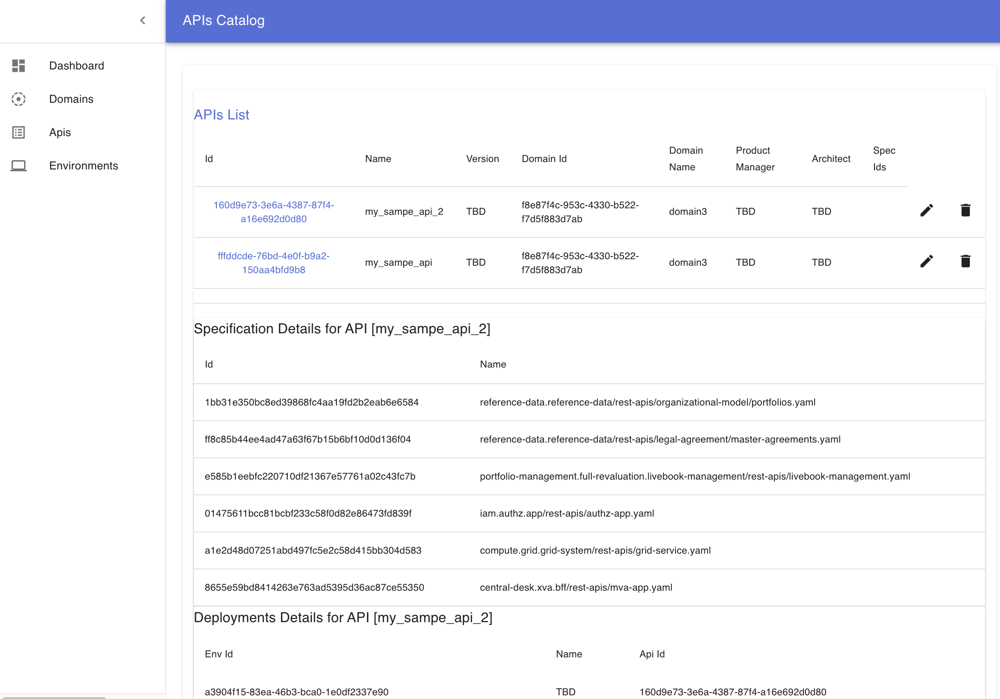

  

## Overview 
> :warning: All of this is, at this stage ideas and POC

The Web UI (at this stage, mostly providing read-only access) to [apis-catalog](https://github.com/omallassi/apis-catalog/).

The dashboard provides

* metrics w.r.t pull requests: # of pull requests, metrics regarding how long pull requests stay opened..
* metrics w.r.t. the catalog: # of operations
* metrics w.r.t. zally: # and types of zally ignore

HTTP backend is available here https://github.com/omallassi/apis-catalog

## More Details
available in the [wiki](https://github.com/omallassi/apis-catalog/wiki).

### Before build
update the `.env` file to point out to your html documentations (redoc, windershins whatever). For prodution, you need to create an `env.production`. 

### Available Build Scripts

In the project directory, you can run:

#### `npm start`

Runs the app in the development mode. 
Open [http://localhost:3000](http://localhost:3000) to view it in the browser.

The page will reload if you make edits. 
You will also see any lint errors in the console.

#### `npm run build`

Compile the app in production mode. 

### Deployment

Please refer to [apis-catalog installation](https://github.com/omallassi/apis-catalog/wiki/installation). 