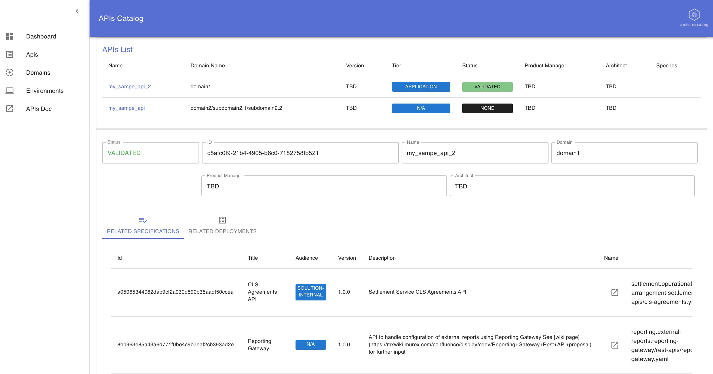

  

## Overview 
> :warning: All of this is, at this stage ideas and POC

The Web UI (at this stage, mostly providing read-only access) to [apis-catalog](https://github.com/omallassi/apis-catalog/). 

The [dashboard provides](https://github.com/omallassi/apis-catalog/wiki/stats-overview)

* metrics w.r.t pull requests: # of pull requests, metrics regarding how long pull requests stay opened..
* metrics w.r.t. the catalog: # of operations, # of resources per domains
* metrics w.r.t. zally: # and types of zally ignore

These metrics are also "enriched" with pull-requests so that you can understand which PR made your stats drifted. 

Then, you can create APIs and manage their lifecycles; 

HTTP backend is available here https://github.com/omallassi/apis-catalog

## Installation 

Please refer to [apis-catalog installation](https://github.com/omallassi/apis-catalog/wiki/installation). 

## More Details
All details are available and centralized in the [wiki](https://github.com/omallassi/apis-catalog/wiki).
